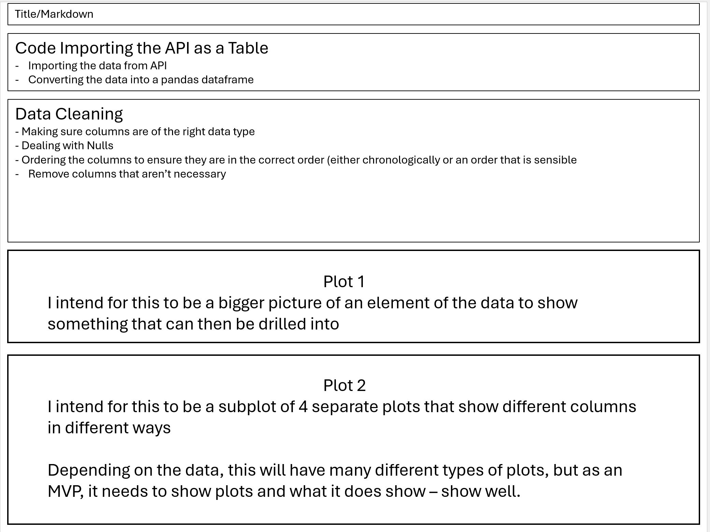
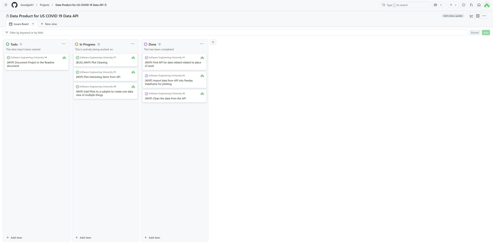
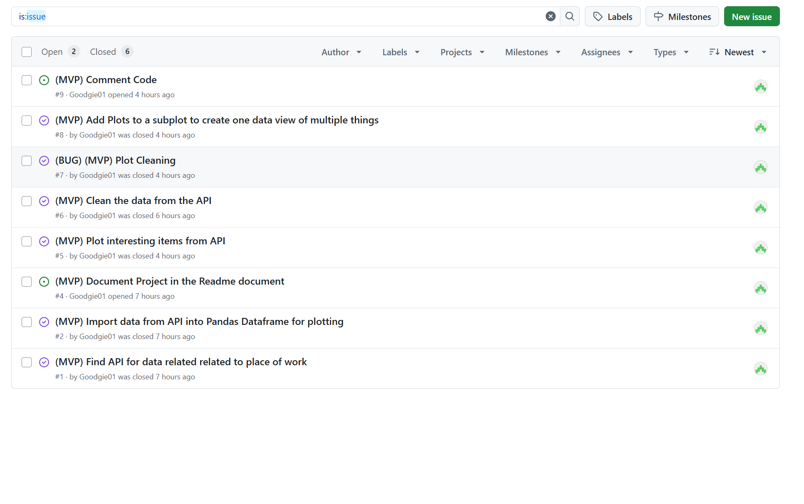

# Software Development Summative 1
For Northeastern University London

# Data Visualisations in Jupyter Notebook with Data from an API

## About
Author: Peter Goodge
GitHub Username: @Goodgie01

I have created a data product in Jupyter Notebook that collects US National COVID-19 data from an API and produces visualisations related to the data on what I've deemed to be interested in focusing on through the data. This can be reused in the format as it has plots produced neatly, the api added clearly and data cleaning documented.

I am to produce a code file that will plot the following:
- Line Plots
- Bar Charts
- Stacked Bar Charts
- One figure containing multiple plotting areas

The code should do the following:
- Connect to an API
- Take in data from an API
- Convert this data from JSON to a pandas dataframe and display the data as such prior to plotting


## Prototype


Above is the prototype of my minimum viable product (MVP) of how I intend for the jupyter notebook to look when the final version is loaded into the GitHub Repo, it stores plots that are regularly used by colleagues at my company, and should the need arise where we need to use data from an API this code is reusable in multiple formats. 

I had designed this in powerpoint as opposed to figma as it suits the format of a jupyter notebook with plots much better, but it shows the layout of the code file as producing prototype plots without knowing what the data (or plots) look like prior to coding and reading into the data. However, if I was producing an app or website for visualisations I would have used figma to design it as it would have suited developing an app with various windows.

## User Documentation

To guide users through the code file I have included pseudocode comments (english that explains what the code is doing) as well as some markdown cells in the code file to explain what I've done for future users/developers of the code file - so it can be tracked.

Prior to running the code please make sure that you have the following packages installed via pip

```python
%pip install pandas
%pip install matplotlib
%pip install datetime
```
The required imports needed for running the rest of the code, are stored in the code file

Clone this repo like below into the directory of your choice using command prompt terminal and you will be good to go
```sh
git clone https://github.com/Goodgie01/Software-Engineering-University.git
```

## Code Development Steps

1. Locate a suitable API that will be relevant to my workplace
2. Connect the Jupyter Notebook to the API
3. Transform the data from JSON to a pandas dataframe
4. View and Clean the data with however many steps necessary
5. Plot the data with various different plot types and columns of data that tell a story and show interesting things from the data

## Development

I have used an agile methodology of developing the code file piece by piece implementing it at different stages

Below is my project Board at one stage of my development


It allows people to be assigned to issues and allows constant development and collaboration on software or one project. To do this I have used GitHub Projects to complete this task.

I had also created tickets in Github issues


While I didn't add labels from github to each issue - I had prefixed each issue with MVP or BUG to determine whether it was a "bug" that needed fixing (for example my plot neatness not happening naturally as the plot is formed - not necessarily a bug as such) or MVP (a basic development on the way to producing the MVP)

## Evaluation
I think as a purpose, this jupyter notebook with plots is very hard coded using a specific API and specific data cleaning steps (which depending on the APIs used for future uses of this code file, may or may not need to be done), however, it fits the purpose it is built for. That being said, I could have done something with test driven development to show the robustness of the code, equally I could've done more to stick with agile methodologies such as developing on branches as opposed to developing my code and project on the main branch (becuase if anything went wrong - it wouldn't have been revertible back to a previous working version - which is bad practice from a software or a code development point of view because you have pull and merge requests to roll it back to.

For future development - I would like to make it less hard coded so that users can provide a link to an API in an input window and then view the data, produce plots and view/download the plots from a window however this requires the data from the API to be 100% clean and curated data as opposed to the data I had used which was cleaned, but still had some cleaning steps to be done.